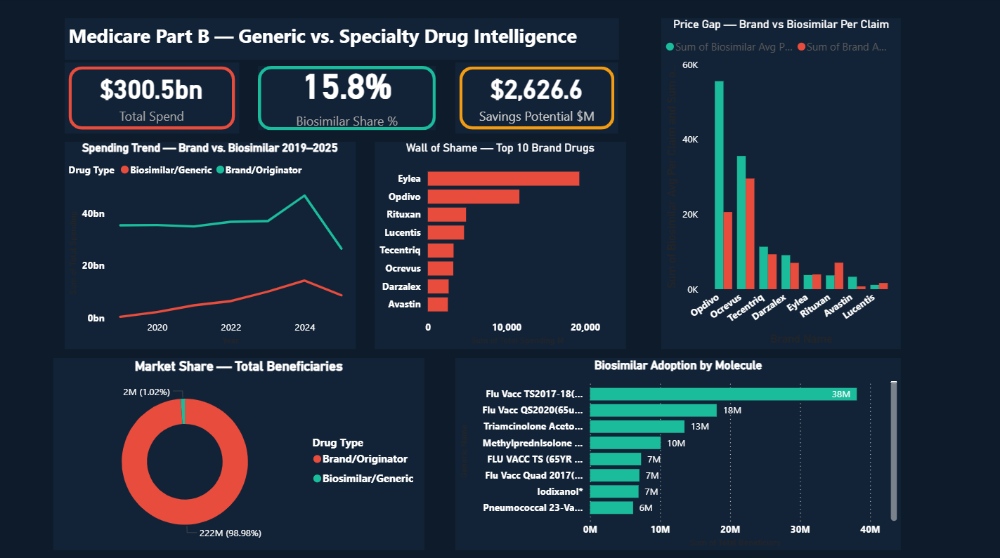

# 💊 Medicare Part B — Generic vs Specialty Drug Dashboard

## 📌 Project Overview
An interactive Power BI dashboard analyzing **$300.5 Billion** 
in Medicare Part B drug spending from 2019–2025.

The goal: Find where Medicare is still spending on expensive 
brand drugs when cheaper biosimilar alternatives exist.

## 🔍 Key Findings
| Metric | Value |
|--------|-------|
| Total Medicare Spend | $300.5B |
| Brand Drug Dominance | 98.98% of beneficiaries |
| Biosimilar Market Share | 15.8% |
| Hidden Savings Potential | $2.6B |
| Biggest Offender | Eylea at $16B |

## 📊 Dashboard Visuals
- **KPI Cards** — Total Spend, Biosimilar Share, Savings Potential
- **Trendline Chart** — Brand vs Biosimilar spending 2019–2025
- **Wall of Shame** — Top 10 wasteful brand drugs
- **Price Gap Chart** — Brand vs Biosimilar cost per claim
- **Market Share Donut** — Overall beneficiary split
- **Adoption Bar Chart** — Biosimilar usage by drug

## 🛠️ Tools Used
- Power BI Desktop
- DAX Measures
- Microsoft Excel
- CMS Medicare Part B Public Data

## 📁 Files in this Repository
- `Medicare_Dashboard.pbix` — Power BI report file
- `Medicare_PowerBI_Ready_v3.xlsx` — Cleaned dataset
- `dashboard_preview.png` — Dashboard screenshot

## 🗄️ Data Source
Centers for Medicare & Medicaid Services (CMS)
Medicare Part B Drug Spending Data — 2019 to 2025
Publicly available at data.cms.gov

## 👤 Author
**Piyush Pandey**
Aspiring Data Analyst | Power BI | Excel | Healthcare Data
